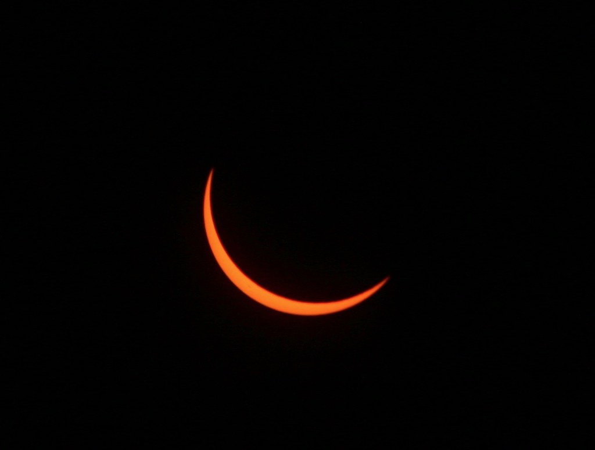

As mentioned in the [tutorial](http://ds-tutorials.oucreate.com/base-tutorial/content/media), there are two ways to add images to your pages. The tutorial walks you through uploading an image and then setting it as the "hero image" used by the page template. It also provides a brief description of adding images within the content. In this post we will demonstrate adding an image within the content.

The Markdown for adding an image looks like ``. If the media has been added to the page that is using it (by uploading it the same way you would before setting it as the hero image), the url can simply be the name of the image, like this: `` or ``. If you are using an image located elsewhere on your website you will need to provide either the full url or the relative url (for example, image.png and ./image.png are relative urls). I strongly recommend uploading the images you use directly to the page (or to a seperate folder on your website). An image posted elsewhere on the internet might be taken down at some point, leaving you with a broken image link.

! Please note the alt text (or alternative text) section in the Markdown for adding an image. It is extremely important to provide good alt text for any image you add to your content. If the image is ever removed, the broken link will display the alt text instead, allowing users to at least know what used to be there. More importantly, visually impaired users can benefit from good alt text, since they may not be able to make use of the image itself.

Note that for this post, there is only one piece of media added. The blog page displays the image on the summary, but the post page does not show the image as a header/hero. If you do not want to use a header image, but still want to show an image with your post, this is an excellent way to do so.

### Photo Credit

Total Solar Eclipse 2017, Wyoming by [Wendy Acker](https://www.flickr.com/people/theodwynn/), [CC BY-NS-SA 4.0](https://creativecommons.org/licenses/by-nc-sa/4.0/)