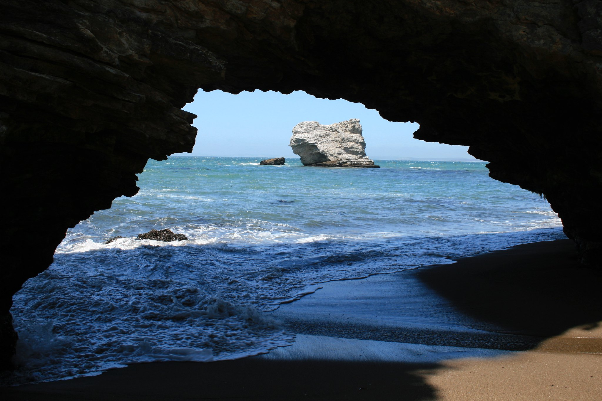
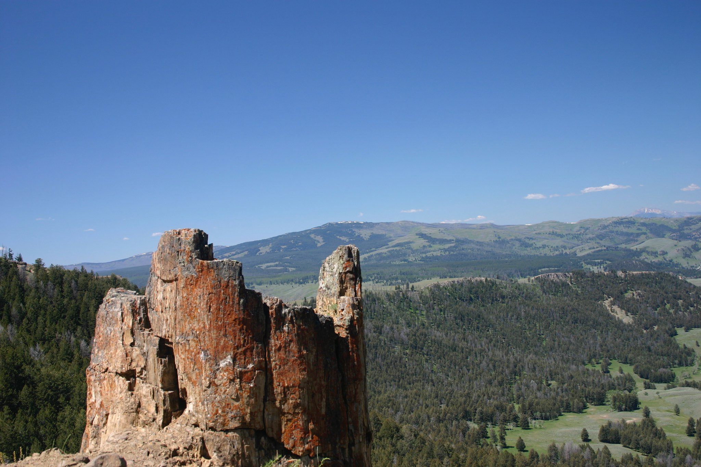

I don't love camping, but I do enjoy hiking (in good weather) and enjoying beautiful nature.

===

The top four parks I have visited are Point Reyes, Yellowstone, Big Bend, and the Grand Canyon, although there are many parks I have not yet been too.

Here is a gorgeous picture of Arch Rock, a location my family and I hiked to at Point Reyes:

This picture does not do Yellowstone justice _at all_, but no one picture can:

### Photo Credit

Arch Rock, Point Reyes National Seashore by [Wendy Acker](https://www.flickr.com/people/theodwynn/), [CC BY-NS-SA 4.0](https://creativecommons.org/licenses/by-nc-sa/4.0/)

Yellowstone Vista by [Wendy Acker](https://www.flickr.com/people/theodwynn/), [CC BY-NS-SA 4.0](https://creativecommons.org/licenses/by-nc-sa/4.0/)